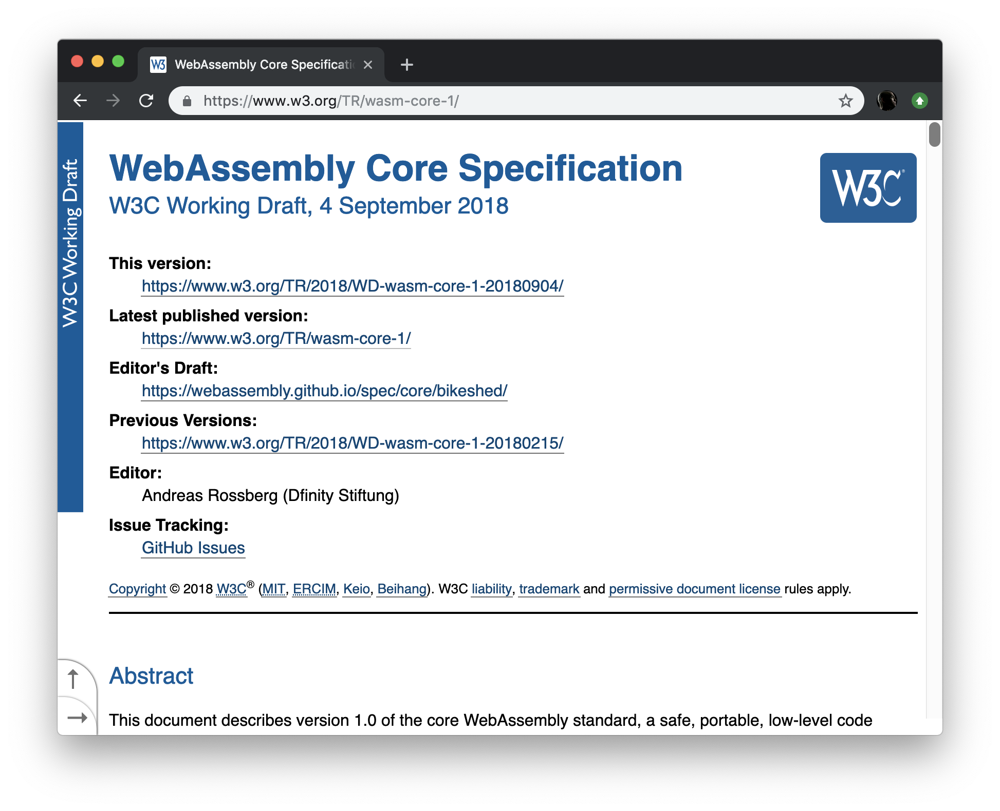
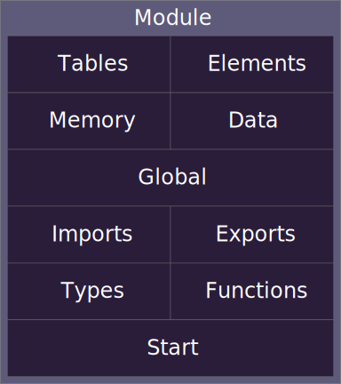

---?title=asd
@title[What is WebAssembly?]

@css[slide-title](What is WebAssembly?)

@box[fragment](**[WebAssembly](https://en.wikipedia.org/wiki/WebAssembly)** is a [standard](https://en.wikipedia.org/wiki/Web_standards "Web standards") that defines a binary format and a corresponding [assembly](https://en.wikipedia.org/wiki/Assembly_language "Assembly language")-like text format for [executables](https://en.wikipedia.org/wiki/Executable "Executable") used by [web pages](https://en.wikipedia.org/wiki/Web_page "Web page").)

@box[fragment slide-title](Let's pick that apart)

---
@css[slide-title](Standard?)



---

@css[slide-title](Binary format?)

@code[hexdump fragment zoom-07](presentation/hello-wasm-hex.txt)

Note: 
- WASM is not ASM.js
- But very inspired by it.

---

@css[slide-title](Assembly language?)

@code[hexdump fragment zoom-07](presentation/hello-wasm-dis.txt)

Note:

- S-expressions

---

@css[slide-title](Executable?)

@box[fragment](The definition is basically something that makes computers do something)

Note:

- Like programs or libraries

---

@css[slide-title](used by web pages?)

@box[fragment](Lies! Despite the name it can be used in all kinds of non-web scenarios)
@box[fragment](We'll be sticking to the web today though)

Note:

- Edge Computing; Fastly and Cloudflare 
- Blockchain; Parity and Near
- Embedded scripting
- Batch and Stream Data Processing
- Serverless/Functions as a Service

---
@css[slide-title](Creating a WebAssembly module)

@box[](It's possible to create modules from the assembly format.)

@box[fragment](But it's much easier to use a language and compile it to WebAssembly)

@box[fragment](There are **[many](https://github.com/appcypher/awesome-wasm-langs)** languages that can compile to WebAssembly)

@box[fragment text-04](AssemblyScript, Astro, Brainfuck, C, C♯ C++, D, Elixir, Faust, Forest, Forth, Go, Grain, Haskell, Java, JavaScript, Julia, Idris, Kotlin/Native, Kou, Lua, Nim, Ocaml, Perl, PHP, Plorth, Poetry, Python, Prolog, Ruby, Rust, Scheme, Wah, Walt, Wam, Xlang, Zig)

---

The examples will be in Rust

@box[fragment](Because it was time to learn a new language anyway)

@box[fragment](...and Rust is pretty cool)

@box[fragment](...and the Rust support for WebAssembly is pretty great!)

---
@css[slide-title](Small JavaScript to Rust dictionary)

@snap[fragment]
<table>
<tr><td>npm<td>cargo
<tr><td>package<td>crate
<tr><td>www.npmjs.com/package<td>crates.io
</table>
@snapend

Note:

 - NPM use a lot of Rust internally

---

@css[slide-title](Hello World)

A minimal program that outputs "42" into a `<div>`

---?code=presentation/hello-wasm-tree.txt&title=Project contents

---?code=hello-wasm/build.sh&title=build.sh

---?code=hello-wasm/crate/cargo.toml&title=cargo.toml

---?code=hello-wasm/web/index.html&title=index.html&lang=text

@[7](Load and instantiate the WebAssembly module)

@[10](Get the reference to the `hello` function)

@[11](Call the `hello` function and set the `innerText` of the `<div>`)

---?code=hello-wasm/crate/src/lib.rs&title=lib.rs

---

Let's see if it works...

@snap[fragment]
That was...underwhelming.
@snapend

---
Let's take a step back

@code[text](presentation/hello-wasm-dis.txt)


@[11-13](The code for the function `func $0`)

@[3](The function signature (taking no arguments, returning an integer))
@[10](Export `func $0` with the name `hello`)
@[4-9](Memory stuff :))

+++
@title[Anatomy of a WebAssembly Module]
@css[slide-title](Anatomy of a WebAssembly Module)



Note:

- Tables — Vectors of typed elements (currently exactly one table of type functype)
- Element — Table initialisation.
  The initial contents of a table is uninitialized. The element component of a module defines a vector that initialize a subrange of a table.

- Memory — Indicates the required min/max memory region sizes in 64k pages. Currently exactly one memory region. 
- Data — Memory initialisation.
  The initial contents of a memory are zero-valued bytes. The 𝖽𝖺𝗍𝖺 component of a module defines a vector of data segments that initialize a range of memory, at a given offset, with a static vector of bytes.

- Global — Vector of global variables and initialisers.
  Each global stores a single value of a specific type. May be immutable.

- Import — Imports from from the host environment
- Export — Exports to the host environment

- Types — List of all function types (signatures) used in the module.
- Functions — List of functions in the module.

- Start — Module entry-point; first method to be called after initialisation

---
@title[Is it fast enough to use?]
@snap[north]
@css[slide-title](Is it fast enough to use?)
@box[fragment](Let's device a test)
@snapend

@snap[midpoint list-content-concise span-60]
@ul
- Use only features JS and WASM share
- Somewhat visually interesting
@ulend
@snapend

Note:
- There are people on the internet making real tests

---
@title[Mandelbrot rendering]
@snap[north]
@css[slide-title](Mandelbrot rendering)
@snapend

@snap[midpoint list-content-concise span-60]
@ul
- Render to canvas
- Use 64 bit floats for precision
- Max 150 iterations per pixel
@ulend
@snapend

Note:
- 64 bits look better, and it's the JS native type.

---
@title[Shared code]
@snap[north]
@css[slide-title](Shared code)
@snapend

@snap[midpoint list-content-concise span-60]
@ul
- `index.html`
- `main.js`
@ulend
@snapend

---?code=mandelbrot-js/web/index.html

@[23](Canvas)
@[24](FPS display)
@[25-29](Load and run)

---?code=mandelbrot-js/web/js/main.js

@[1](Import the mandelbrot renderer module)

@[37](Initialise the renderer)
@[39](Extract rendering context)
@[69](Request animation)

@[51](Render the fractal into the imageData)
@[53](Put the rendered image on the scren)

---
@title[JavaScript specific code]
@snap[north]
@css[slide-title](JavaScript specific code)
@snapend

@snap[midpoint list-content-concise span-60]
@ul
- `mandelbrot.js`
@ulend
@snapend

---

@code[js code-reveal-fast](mandelbrot-js/web/js/mandelbrot.js)

@[1-13](Initialisation)
@[2-4](Create imageData)
@[5-7](Create renderer)


@[15](Actual rendering method)
@[27-31](For each pixel)
@[32](Call the iterate function)
@[49-61](Maths happen)

@[34](Make up some pixel intensity value)

@[35-40](Set the pixel color)

---
@title[Rust specific code]
@snap[north]
@css[slide-title](Rust specific code)
@snapend

@snap[midpoint list-content-concise span-60]
@ul
- `mandelbrot.js`
- `lib.rs`
@ulend
@snapend

---
@code[js code-reveal-fast](mandelbrot-wasm/web/js/mandelbrot.js)

@[1-20](Initialisation)
@[2-4](Load the module)
@[5-7](Create pixel buffer)
@[8-12](Create imageData)

@[13-14](Create renderer)

---
@code[rust code-reveal-fast](mandelbrot-wasm/crate/src/lib.rs)

@[8-14](Allocate the shared memory)

@[16-29](Rendering method shim)

@[31-39](Method signature, the arguments have types!)
@[51-55](For each pixel)
@[56](Call the iterate function)
@[73-85](Maths happen)

@[58](Make up some pixel intensity value)

@[59-64](Set the pixel color)

---
Let's see if it works...

@snap[fragment]
That was...better!
@snapend

---
Performance is pretty much identical

---
@title[Can you do all the things you need to?]
@snap[north]
@css[slide-title](Can you do all the things you need to?)
@box[fragment](Let's device a test)
@snapend

@snap[midpoint list-content-concise span-60]
@ul
- Somewhat visually interesting
- Do more in Rust
@ulend
@snapend

---?code=presentation/mandelbrot-webgl-tree.txt&title=Project contents&lang=text

---
@title[Using all the tools]
@snap[north]
@css[slide-title](Using all the tools)
@snapend

@snap[midpoint list-content-concise span-60]
@ul
- NPM
  - left-pad
- Webpack
  - wasm-pack
- Cargo
  - wasm-bindgen
@ulend
@snapend

---
Let's see if it works...

---

@box[fragment slide-title](Did it work?)
@box[fragment slide-title](Yes...)
@box[fragment slide-title](How painful was it?)
@box[fragment slide-title](Quite.)
@box[fragment slide-title](Mostly due to WebGL APIs, Otherwise it was quite pleasant.)

---

There are still a few sharp edges that needs cleaning up.

@box[fragment](Most are to do with the JS language being untyped and Rust being strongly typed.)
@box[fragment](Rust also doesn't have a concept of `null`/`undefined` etc.)
 

---
In particular the `requestAnimationFrame` callback code is horrendous

```rust
    let f: Rc<RefCell<Option<_>>> = Rc::new(RefCell::new(None));
    let g: Rc<RefCell<Option<_>>> = f.clone();
    *g.borrow_mut() = Some(Closure::new(move || {

        ...
        request_animation_frame(f.borrow().as_ref().unwrap());
    }));

    request_animation_frame(g.borrow().as_ref().unwrap());
```

---
There are several projects creating wrapping API to improve these things

---
@title[Browser support]
@snap[north]
@css[slide-title](Browser support)
@snapend


[caniuse](https://caniuse.com/#feat=wasm) says it's exceeding 90%.
@box[fragment](Probably enough for deploying internal apps today, and starting development of larger apps)

---

But it's supposed to be faster? Why wasn't it faster?

@box[fragment](It can be!)
@box[fragment](For larger apps, the payloads will be smaller)
@box[fragment](Streaming loading/compilation can make time-to-interactive shorter)
@box[fragment](Data heavy tasks, integer maths and tasks that can take advantage of SIMD instructions)
@box[fragment](It's very young tech still)

---

Cool links I found

- [A cartoon intro to WebAssembly](https://hacks.mozilla.org/2017/02/a-cartoon-intro-to-webassembly/)
- [Oxidizing Source Maps with Rust and WebAssembly](https://hacks.mozilla.org/2018/01/oxidizing-source-maps-with-rust-and-webassembly/)
- [Maybe you don't need Rust and WASM to speed up your JS](https://mrale.ph/blog/2018/02/03/maybe-you-dont-need-rust-to-speed-up-your-js.html)
- [Speed Without Wizardry](http://fitzgeraldnick.com/2018/02/26/speed-without-wizardry.html)
- [Fast, Bump-Allocated Virtual DOMs with Rust and Wasm](https://hacks.mozilla.org/2019/03/fast-bump-allocated-virtual-doms-with-rust-and-wasm/)
- [WebAssembly Load Times and Performance](https://blogs.unity3d.com/2018/09/17/webassembly-load-times-and-performance/)

